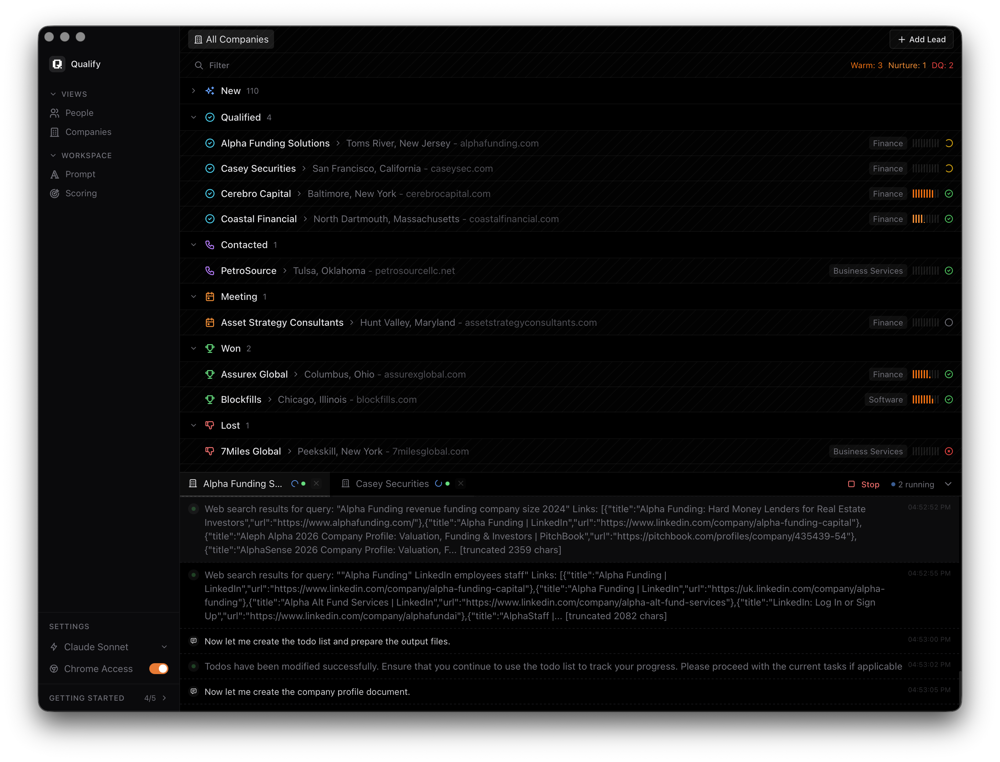
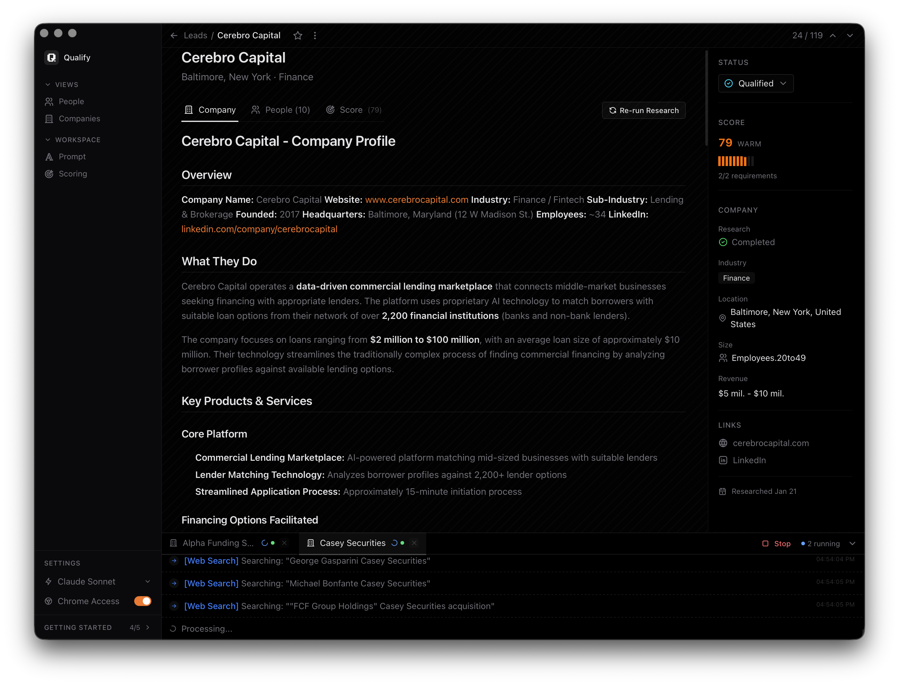
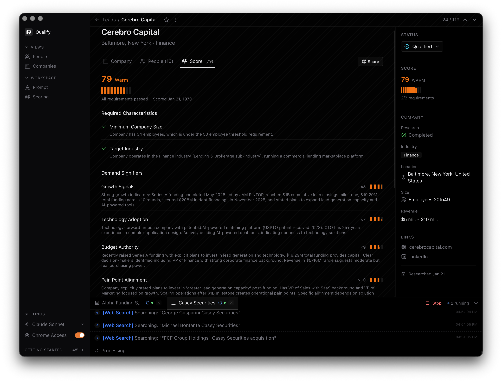

# Qual

AI-powered B2B lead research and qualification desktop app. Uses Claude to automatically research companies, score leads, and help you focus on the opportunities that matter.



## What it does

Qual takes a list of companies and does the tedious research work for you:

- **Deep company research** - Automatically pulls company information, business model, products/services, employee count, funding, and more
- **AI-powered scoring** - Scores leads against your custom criteria (target industry, company size, growth signals, urgency indicators)
- **Contact discovery** - Finds relevant people at each company with their roles and contact details
- **Real-time streaming** - Watch research happen live as Claude investigates each lead



## Lead Scoring

Define your ideal customer profile and let Qual score every lead automatically:

- Required characteristics (industry, size, location)
- Demand signifiers (technology adoption, recent changes)
- Growth signals (funding, hiring, expansion)
- Urgency indicators (contract renewals, pain points)

Each lead gets a score from 0-100 with detailed reasoning you can review.



## Tech Stack

- **Frontend**: React 19, TypeScript, Tailwind CSS 4, Zustand
- **Backend**: Rust, Tauri 2, SQLite
- **AI**: Claude CLI (runs locally, your API key)

## Getting Started

### Prerequisites

- [Bun](https://bun.sh) (or npm/yarn)
- [Rust](https://rustup.rs)
- [Claude CLI](https://claude.ai/code) with API access

### Installation

```bash
# Clone the repo
git clone https://github.com/yourusername/qual.git
cd qual

# Install dependencies
bun install

# Run in development
bun run tauri:dev
```

### Build for Production

```bash
bun run tauri:build
```

## Usage

1. **Add leads** - Import companies manually or paste a list
2. **Configure scoring** - Set up your ideal customer criteria in the Scoring tab
3. **Run research** - Select leads and click Research to start AI analysis
4. **Review and qualify** - Check scores, read summaries, update lead status

## Project Structure

```
src/                    # React frontend
├── pages/              # Main views (list, detail)
├── components/         # UI components
└── lib/
    ├── store/          # Zustand state management
    └── tauri/          # Backend integration

src-tauri/src/          # Rust backend
├── commands/           # Tauri command handlers
├── db/                 # SQLite schema and queries
└── jobs/               # Async job queue for research
```

## License

MIT
